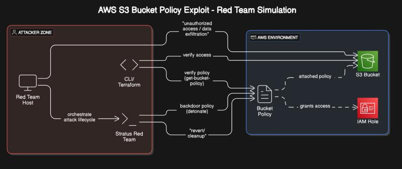

# AWS Red Team Simulation: S3 Bucket Policy Exfiltration via Stratus

This project demonstrates a controlled, automated red team exercise simulating a common data exfiltration technique in AWS. Using the open-source attack framework **Stratus Red Team**, I successfully backdoored an S3 bucket policy to grant unauthorized access and then safely reverted the environment to its original state.

The entire attack lifecycle—from provisioning infrastructure with Terraform, to detonating the attack, and cleaning up—was managed through Stratus, showcasing a modern, programmatic approach to testing and validating cloud security postures.

---
## Attack Methodology & Workflow

The simulation follows a structured methodology where an attacker, from an external host, uses Stratus Red Team to orchestrate the exploit. The framework abstracts the attack into a clean, multi-stage lifecycle.

1.  **Warmup:** Stratus uses Terraform to provision the necessary prerequisite infrastructure in the target AWS account (e.g., the target S3 bucket).
2.  **Detonate:** Stratus applies the malicious configuration—in this case, attaching a backdoor policy to the S3 bucket that grants an external IAM principal `s3:*` access.
3.  **Verification:** The attacker uses the AWS CLI to verify that the malicious policy is active and that they have gained unauthorized access.
4.  **Revert & Cleanup:** Stratus safely reverts the malicious change and then uses Terraform to destroy all created infrastructure, leaving the environment in a clean, "cold" state.

*
Figure 1: The attack workflow, showing the interaction between the attacker, Stratus, and the AWS environment.
*

---
## Execution: Detonation & Verification

The core of the simulation is the "detonation" phase. After `warming up` the technique, the `stratus detonate` command was executed. This action applies the malicious bucket policy.

**Analysis:** The screenshot below captures the successful detonation. I immediately ran `aws s3api get-bucket-policy` against the target bucket. The returned JSON policy is the proof of a successful exploit: it contains a statement granting `s3:*` permissions to an external `root` user, effectively backdooring the bucket. The Stratus status confirms the technique is `DETONATED`.

*
Figure 2: Successful detonation and verification of the malicious S3 bucket policy.
*

---
## Remediation: Revert & Cleanup

A critical part of any professional red team exercise is the ability to safely undo all actions. Stratus manages this through its `revert` and `cleanup` commands.

**Analysis:** The `stratus revert` command cleanly removes the malicious bucket policy. To validate this, I immediately ran `aws s3api get-bucket-policy` again. The command now returns a `NoSuchBucketPolicy` error, providing definitive proof that the backdoor was removed and the bucket is no longer exposed. The Stratus status returns to `WARM`, indicating the environment is safe. The final `stratus cleanup` command (not pictured) then destroys all infrastructure.

*
Figure 3: Successful reversion of the attack, confirmed by the inability to retrieve the malicious policy.
*

---
## 🚀 Skills & Technologies Demonstrated

* **Red Team Operations:** Executing and managing the lifecycle of a simulated cloud attack.
* **Stratus Red Team:** Using an automated framework to test and validate cloud security defenses.
* **AWS S3 & IAM:** Deep understanding of S3 bucket policies, IAM principals, and how they can be misconfigured for data exfiltration.
* **Terraform & IaC:** Using Infrastructure as Code to programmatically provision and manage cloud resources for attack simulations.
* **AWS CLI:** Using command-line tools to interact with the AWS API for verification and analysis.
* **Cloud Security Posture Management:** Simulating attacks to identify weaknesses in cloud configurations.
